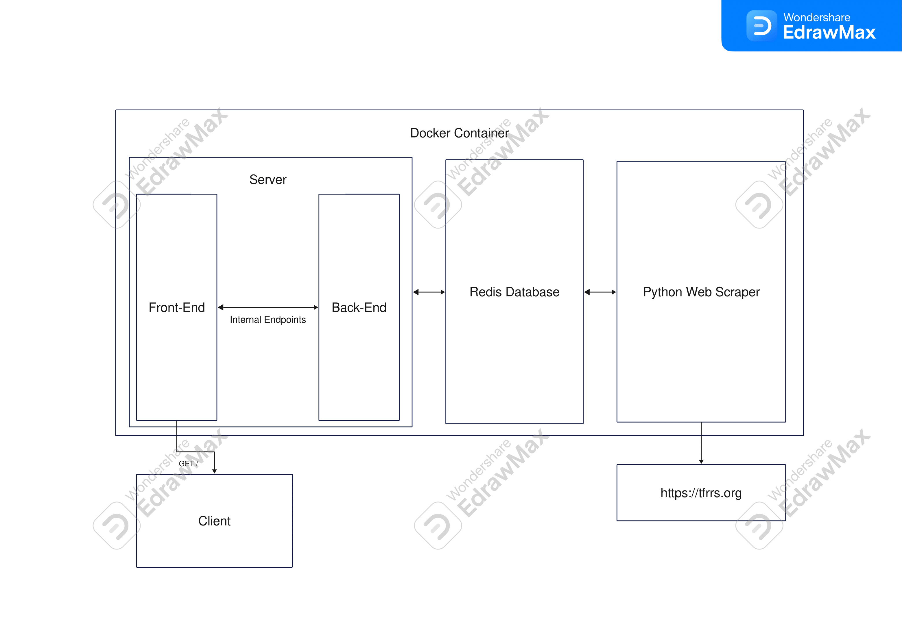

# TFRRS Meet Simulator
An app that uses updated data scraped from [tfrrs.org](https://www.tfrrs.org/) to create interactive championship meet simulations.

### Project Members
- Geoffrey Kleinberg
- Nathan Hajel
- Trevor Gray

## System Architecture



## Test the System

To test the system, run `scripts/test` from the root directory.

## Deploy the Site

### Run on Localhost

Run `scripts/up` to start the dockerized container and run the server. Run `scripts/down` to bring the server down. After any change to the code, run `scripts/rebuild` to rebuild the docker containers before running `scripts/up` again.

Alternatively, use `scripts/dev/redeploy` which will bring the server down (if up), rebuild, and put the server up.

### Run on EC2

Run the following commands:
```
sudo yum install git
git clone https://github.com/cs298-398f23/geoff-nate-trevor-final.git
cd geoff-nate-trevor-final
sudo scripts/prod/deploy
```

To redeploy after changes to the main branch of the git repository, run `sudo scripts/prod/redeploy`.

## Internal Endpoint Structure

### Results

Get results for the specificied season and gender: `/results?season={season}&gender={gender}`

##### Query Parameters

`season` (required): The season to find the results for, using the TFRRS season ID. Example '4249' for Outdoor 2023 or '4011' for Indoor 2023.

`gender` (required): Either 'm' for Male or 'f' for Female.

##### Response

Response is a JSON object, modeled below:

```
{
    'eventName': [
        {'place': 1, 'name': 'Name', 'team': 'Team', 'mark': 'Time/Distance'},
        ...
    ],
    ...
}
```

### Seasons

Get a list of available seasons: `/seasons`

##### Response

Response is a JSON object, modeled below:

```
{
    'seasons': [
        {seasonID: 'displayName'},
        ...
    ]
}
```

### Current Season

Get the current season: `/currentSeason`

##### Response

Response is a JSON object, modeled below:

```
{
    'current_season': current_season
}
```

### Load Saved Scenario

Load a scenario that was saved: `/loadSaved?id={id}&season={season}&gender={gender}`

##### Query Parameters

`id` (required): The ID of the saved scenario.

`season` (required): The season that the scenario takes place in.

`gender` (required): The gender for the scenario.

##### Response

Response is a JSON object, modeled below:

```
{
    'eventName': [
        {'place': 1, 'name': 'Name', 'team': 'Team', 'mark': 'Time/Distance'},
        ...
    ],
    ...
}
```

### Get All Saved Scenarios

Get a list of all saved scenario names: `/savedResults?season={season}&gender={gender}`

##### Query Parameters

`season` (required): The season to get scenarios for.

`gender` (required): The gender to get scenarios for.

##### Response

Response is a JSON object, modeled below:

```
{
    'saved_results': ['name1', 'name2', ...]
}
```

### Save a Scenario

Save the current state as a scenario: `/saveResults?season={season}&gender={gender}`

##### Request Method

Must be sent as a  `POST` request.

##### Query Parameters

`season` (required): The season that the scenario takes place in.

`gender` (required): The gender for the scenario.

##### Body Format

Body is a JSON object, modeled below:

```
{
    'saveName': saveName,
    'results': {
        'eventName': [
            {'place': 1, 'name': 'Name', 'team': 'Team', 'mark': 'Time/Distance'},
            ...
        ],
        ...
    }
}
```